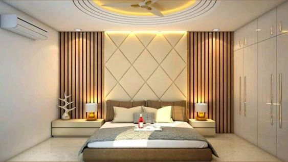
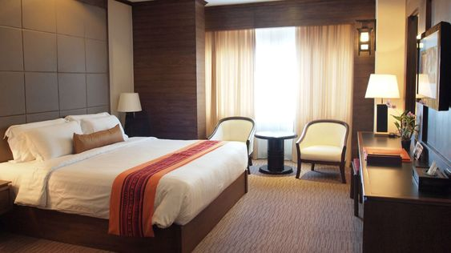
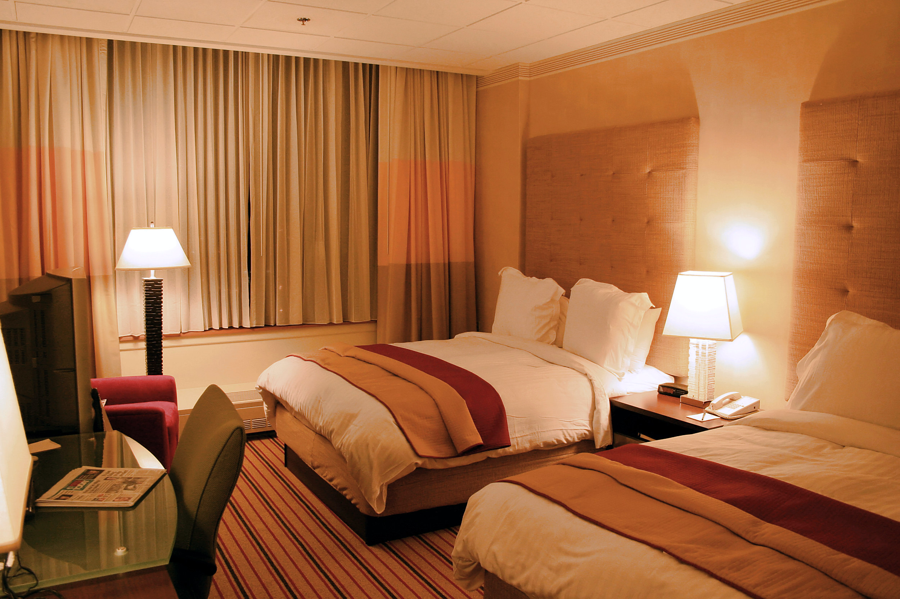
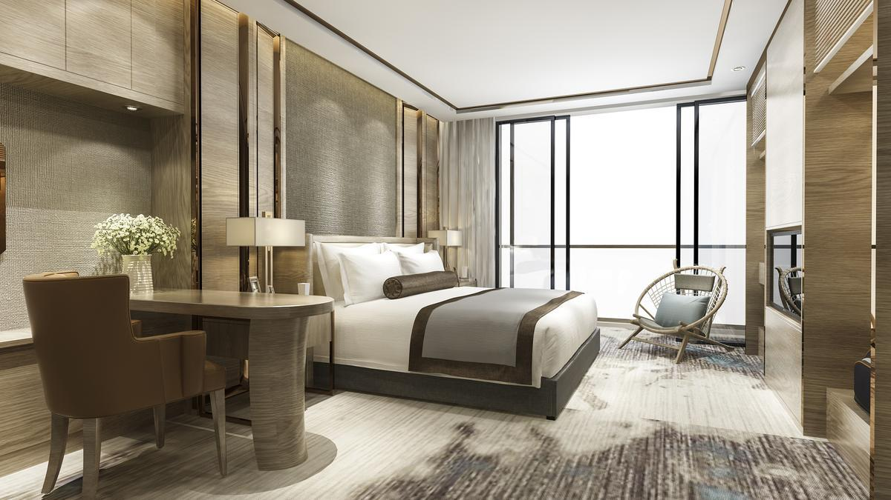

<!DOCTYPE html>
<html lang="en">
<head>
  <meta charset="UTF-8">
  <meta http-equiv="X-UA-Compatible" content="IE=edge">
  <meta name="viewport" content="width=device-width, initial-scale=1.0">
  <title>Hotel</title>
  <link rel="stylesheet" href="https://cdn.jsdelivr.net/npm/swiper/swiper-bundle.min.css" />
  <link rel="stylesheet" href="gio.css">
</head>
<body>
  <header>
    

      
      <input type="checkbox" id="menu" />
      <label for="menu"></label>
      <nav class="navbar">
        <ul>
          <li><a href="#inicio">Inicio</a></li>
          <li><a href="#servicios">Servicios</a></li>
          <li><a href="#cuartos">Cuartos</a></li>
          <li><a href="#contactos">Contactos</a></li>
        </ul>
      </nav>
    

    

      

        

          

          

          

        

        

        

        

      

      <a href="#" class="enlace">Para más información</a>
    

  </header>

  <section id="servicios" class="servicios">
    

      

        

Servicio 1

        

Servicio 2

        

Servicio 3

        

Servicio 4

      

      

      

    

  </section>

  <section id="cuartos" class="habitaciones">
    

      

        

          

            
            

              <h4>Habitación Simple</h4>
              
Habitación individual con baño privado

              S/100 x noche
              <a href="simple.html" class="btn-ver">Ver Habitaciones</a>
            

          

        

        

          

            
            

              <h4>Habitación Doble</h4>
              
Habitación doble con baño privado

              S/250 x noche
              <a href="doble.html" class="btn-ver">Ver Habitaciones</a>
            

          

        

        

          

            
            

              <h4>Habitación Matrimonial</h4>
              
Habitación con jacuzzi

              S/1000 x noche
              <a href="matrimonial.html" class="btn-ver">Ver Habitaciones</a>
            

          

        

        

          

            
            

              <h4>Habitación Presidencial</h4>
              
Habitación lujosa

              S/2250 x noche
              <a href="presidencial.html" class="btn-ver">Ver Habitaciones</a>
            

          

        

        

          

            
            

              <h4>Habitación Suite</h4>
              
Habitación individual con jacuzzi

              S/1500 x noche
              <a href="suite.html" class="btn-ver">Ver Habitaciones</a>
            

          

        

      

      

      

    

  </section>

  <section id="carrito" class="carrito">
    

      <h2>Carrito de Reserva</h2>
      

      <button id="finalizar-reserva" class="btn-reservar">Finalizar Reserva</button>
    

  </section>

  <section id="contactos" class="contactos">
    

      <h2>Contactos</h2>
    

  </section>

  <footer class="footer container">
    

    

      
      

        <ul>
          <li><a href="#inicio">Inicio</a></li>
          <li><a href="#nosotros">Nosotros</a></li>
          <li><a href="#productos">Productos</a></li>
          <li><a href="#contactos">Contactos</a></li>
        </ul>
        

          
          
          
        

        
@hotel

      

    

  </footer>
  
  
</body>
</html>
